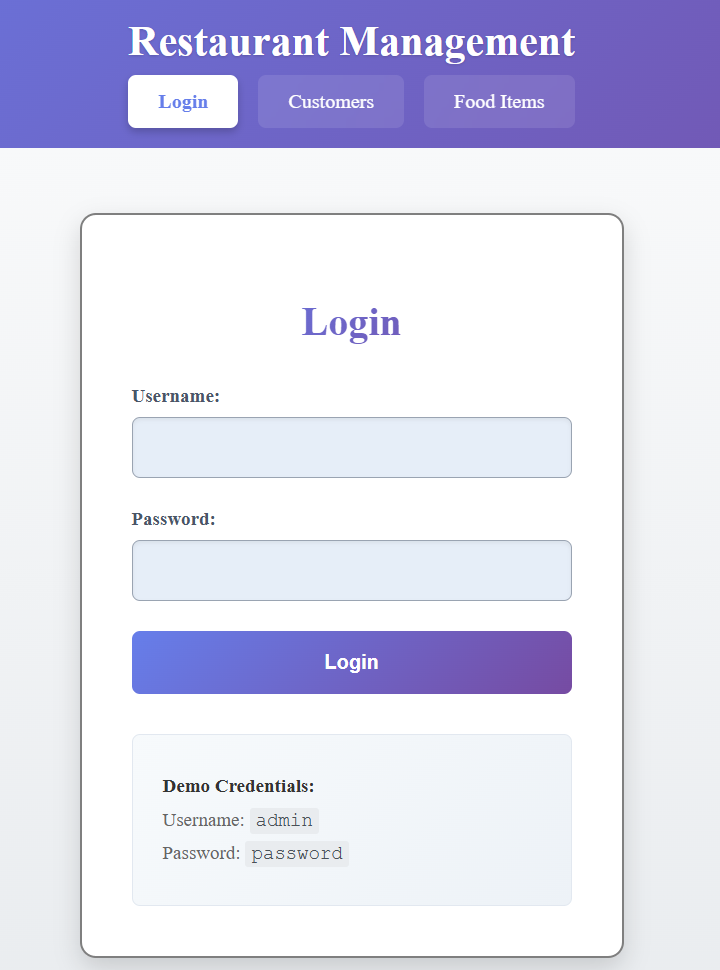
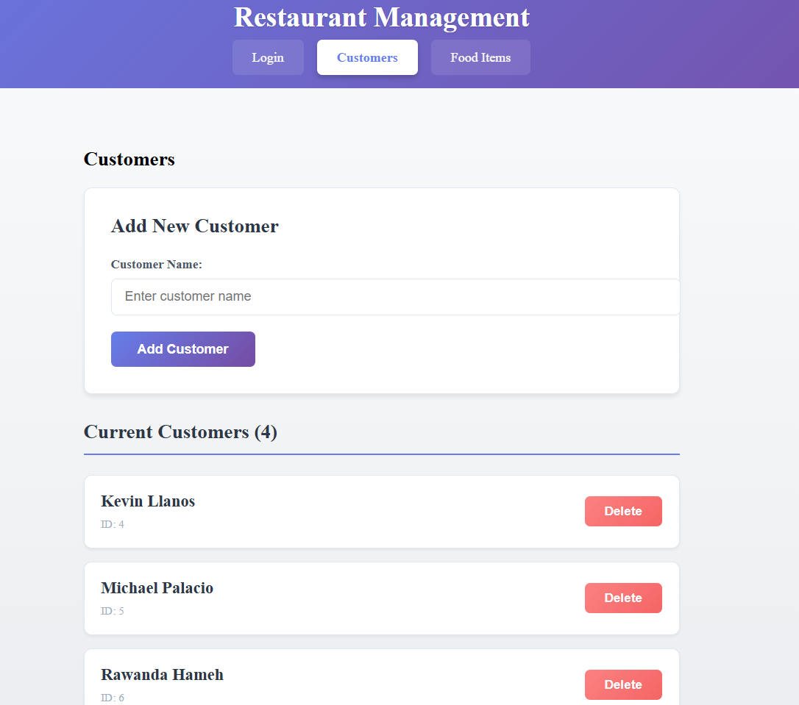
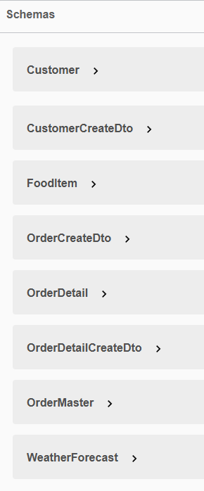
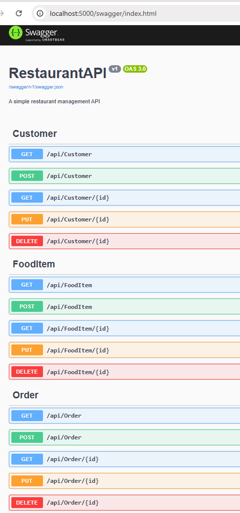
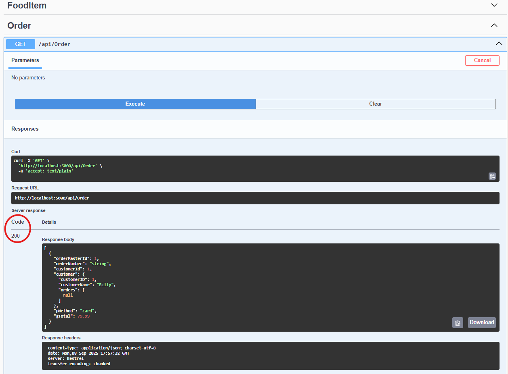

# RestaurantAPI (.NET 9 + EF Core + SQL Server)

A production‑ready REST API built with .NET 9 and ASP.NET Core Web API, designed to manage customers, menu items, and orders (including master/detail relationships) in a restaurant domain. Implements Entity Framework Core with SQL Server for robust data persistence, and exposes clean, documented endpoints via Swagger UI. The solution supports containerization with Docker and infrastructure automation using Terraform for deployment to Azure Container Apps and Azure Container Registry. Built with clean DTO patterns, modular controllers, and a focus on scalability, maintainability, and integration readiness — making it equally suited for local development, enterprise environments, or cloud‑native deployments.

## Tech stack
- .NET 9 SDK
- ASP.NET Core Web API
- EF Core (SqlServer, Design)
- SQL Server (Express or LocalDB)
- Swagger UI

## Prerequisites
- .NET 9 SDK installed (`dotnet --version`)
- SQL Server running locally (SQLEXPRESS or LocalDB)
- Git
- EF Core tools: `dotnet tool install --global dotnet-ef`

## Repository layout
- Solution root: `C:/Projects/RestaurantAPI`
- Project: `RestaurantAPI/RestaurantAPI.csproj`
- DbContext: `Models/RestaurantDbContext.cs`
- Entities: `Customer`, `FoodItem`, `OrderMaster`, `OrderDetail`
- DTOs: `CustomerCreateDto`, `OrderCreateDto`, `OrderDetailCreateDto`

## DTOs (Data Transfer Objects)
The API uses DTOs for clean data contracts:
- **CustomerCreateDto**: For creating new customers with optional orders
- **OrderCreateDto**: For creating new orders with order details
- **OrderDetailCreateDto**: For individual order line items

## Database Configuration
Edit `RestaurantAPI/appsettings.json`:
- ConnectionStrings.DevConnection (example for SQL Express):
  - `Server=localhost\\SQLEXPRESS;Database=RestaurantDB;Trusted_Connection=True;TrustServerCertificate=True;MultipleActiveResultSets=True;`
- Example for LocalDB:
  - `Server=(localdb)\\MSSQLLocalDB;Database=RestaurantDB;Trusted_Connection=True;MultipleActiveResultSets=True;`


## QUICK START GUIDE
From the project directory (`RestaurantAPI`):

1) Restore and build
- `dotnet restore`
- `dotnet build`

2) Install packages/tools (if not already installed)
- `dotnet add package Microsoft.EntityFrameworkCore.SqlServer`
- `dotnet add package Microsoft.EntityFrameworkCore.Design`
- `dotnet tool install --global dotnet-ef`

3) Create the database schema
- If migrations already exist (folder `Migrations` present):
  - `dotnet ef database update --context RestaurantDbContext`
- If starting fresh (no migrations):
  - `dotnet ef migrations add InitialCreate --context RestaurantDbContext`
  - `dotton ef database update --context RestaurantDbContext`

## Run
- `dotnet run`
- Swagger UI: open the URL printed in console (e.g., `http://localhost:5000/swagger`).

## API quickstart
- Customers
  - `GET /api/Customer`
- Food items
  - `GET /api/FoodItem`
  - `GET /api/FoodItem/{id}`
  - `POST /api/FoodItem`
  - `PUT /api/FoodItem/{id}`
  - `DELETE /api/FoodItem/{id}`
- Orders
  - Explore in Swagger if `OrderController` is present.


## Authentication (JWT demo)
This project includes a simple JWT demo to protect write operations. It is intended for learning and testing only.

- Token endpoint (demo):
  - POST /api/auth/token
  - Body: { "username": "admin", "password": "password" }
  - Response: { "token": "<jwt>" }
- Demo credentials (hardcoded for the sample project):
  - username: admin
  - password: password
- How to use the token:
  - Add an Authorization header to protected requests:
    - Authorization: Bearer <token>
  - In Swagger UI click "Authorize" and paste: Bearer <token>
- Token details:
  - Signed with the HMAC key in `appsettings.json` (Jwt:Key) for the demo
  - Expires after 1 hour
- Security notes (do this before production):
  - Do not use hardcoded credentials or the dev key in production.
  - Move the Jwt:Key to user-secrets for local development:
    - `cd RestaurantAPI`
    - `dotnet user-secrets init`
    - `dotnet user-secrets set "Jwt:Key" "your-secret-key"`
  - In production inject secrets via environment variables or a secret store (Azure Key Vault, AWS Secrets Manager, etc.)
  - Replace the demo token issuer with a proper identity provider (Azure AD, Auth0, IdentityServer) for real deployments.


## DO IT YOURSELF GUIDE, STEP BY STEP (Visual Studio 2022)
These steps work for either the "ASP.NET Core Web API" template or the "ASP.NET Core Web App (Model-View-Controller)" template. This project uses API controllers; the Web API template is recommended.

1) **Create the solution and project**
   - File > New > Project > ASP.NET Core Web API
   - Framework: .NET 9, Enable controllers + OpenAPI support

2) **Add EF Core packages** via NuGet Package Manager:
   - `Microsoft.EntityFrameworkCore.SqlServer`
   - `Microsoft.EntityFrameworkCore.Design`

3) **Add connection string** to `appsettings.json`:
```json
"ConnectionStrings": {
  "DevConnection": "Server=localhost\\SQLEXPRESS;Database=RestaurantDB;Trusted_Connection=True;TrustServerCertificate=True;MultipleActiveResultSets=True;"
}
```

4) **Create entity classes** (Models folder):
```csharp
// Customer.cs
public class Customer {
  [Key] public int CustomerID { get; set; }
  [Column(TypeName = "nvarchar(100)")][Required]
  public string CustomerName { get; set; } = string.Empty;
  public virtual ICollection<OrderMaster> Orders { get; set; } = new List<OrderMaster>();
}

// FoodItem.cs
public class FoodItem {
  [Key] public int FoodItemId { get; set; }
  [Column(TypeName = "nvarchar(100)")] public string FoodItemName { get; set; } = string.Empty;
  public decimal Price { get; set; }
}

// OrderMaster.cs
public class OrderMaster {
  [Key] public long OrderMasterId { get; set; }
  [Column(TypeName = "nvarchar(75)")] public string OrderNumber { get; set; } = string.Empty;
  public int CustomerId { get; set; }
  public Customer Customer { get; set; } = null!;
  [Column(TypeName = "nvarchar(10)")] public string PMethod { get; set; } = string.Empty;
  public decimal GTotal { get; set; }
  public List<OrderDetail> OrderDetails { get; set; } = new();
  [NotMapped] public string DeletedOrderItemIds { get; set; } = string.Empty;
}

// OrderDetail.cs
public class OrderDetail {
  [Key] public long OrderDetailId { get; set; }
  public long OrderMasterId { get; set; }
  public int FoodItemId { get; set; }
  public FoodItem FoodItem { get; set; } = null!;
  public decimal FoodItemPrice { get; set; }
  public int Quantity { get; set; }
}
```

5) **Create DbContext** (Models/RestaurantDbContext.cs):
```csharp
public class RestaurantDbContext : DbContext {
  public RestaurantDbContext(DbContextOptions<RestaurantDbContext> options) : base(options) {}
  public DbSet<Customer> Customers => Set<Customer>();
  public DbSet<FoodItem> FoodItems => Set<FoodItem>();
  public DbSet<OrderMaster> OrderMasters => Set<OrderMaster>();
  public DbSet<OrderDetail> OrderDetails => Set<OrderDetail>();
  
  protected override void OnModelCreating(ModelBuilder modelBuilder) {
    // Relationships and constraints
    modelBuilder.Entity<OrderMaster>()
      .HasOne(om => om.Customer).WithMany(c => c.Orders)
      .HasForeignKey(om => om.CustomerId).OnDelete(DeleteBehavior.Restrict);
    modelBuilder.Entity<OrderDetail>()
      .HasOne(od => od.FoodItem).WithMany()
      .HasForeignKey(od => od.FoodItemId).OnDelete(DeleteBehavior.Restrict);
    modelBuilder.Entity<OrderDetail>()
      .HasOne<OrderMaster>().WithMany(om => om.OrderDetails)
      .HasForeignKey(od => od.OrderMasterId).OnDelete(DeleteBehavior.Cascade);
    
    // Decimal precision
    modelBuilder.Entity<FoodItem>().Property(f => f.Price).HasColumnType("decimal(18,2)");
    modelBuilder.Entity<OrderMaster>().Property(om => om.GTotal).HasColumnType("decimal(18,2)");
    modelBuilder.Entity<OrderDetail>().Property(od => od.FoodItemPrice).HasColumnType("decimal(18,2)");
  }
}
```

6) **Register DbContext** in Program.cs:
```csharp
builder.Services.AddDbContext<RestaurantDbContext>(options =>
  options.UseSqlServer(builder.Configuration.GetConnectionString("DevConnection")));

// Auto-migrate on startup (after app = builder.Build())
using (var scope = app.Services.CreateScope()) {
  var db = scope.ServiceProvider.GetRequiredService<RestaurantDbContext>();
  db.Database.Migrate();
}
```

7) **Add controllers** (Controllers folder): FoodItemController (CRUD), CustomerController (GET list)

8) **Create DTOs** (DTOs folder):
```csharp
// CustomerCreateDto.cs
public class CustomerCreateDto {
  [Required] public string CustomerName { get; set; } = string.Empty;
  public List<OrderCreateDto>? Orders { get; set; }
}

// OrderCreateDto.cs
public class OrderCreateDto {
  [Required] public string OrderNumber { get; set; } = string.Empty;
  public string PMethod { get; set; } = string.Empty;
  public List<OrderDetailCreateDto> OrderDetails { get; set; } = new();
}

// OrderDetailCreateDto.cs
public class OrderDetailCreateDto {
  public int FoodItemId { get; set; }
  public int Quantity { get; set; }
  public decimal FoodItemPrice { get; set; }
}
```

9) **Generate and apply migrations** (Package Manager Console):
   - `Add-Migration InitialCreate -Context RestaurantDbContext`
   - `Update-Database -Context RestaurantDbContext`

10) **Run and test**: Press F5 or `dotnet run`, then open Swagger at the printed URL

## Cloud deployment Steps (Terraform + Azure Container Apps)
- Overview:
  - Infrastructure as Code with Terraform (terraform folder). Creates: Resource Group, Log Analytics Workspace (PerGB2018, 30-day retention), Azure Container Registry (Basic), Container Apps Environment, and a Container App with public ingress.
  - Security: Container App uses a system-assigned managed identity; Terraform grants it AcrPull on the ACR. No ACR admin creds in code.
  - Cost: App runs with 0.25 vCPU / 0.5Gi and scales to zero when idle; ACR Basic; minimal Log Analytics retention.
  - Networking: External ingress on port 8080; traffic routes 100% to latest revision.
  - Files: `main.tf` (resources), `variables.tf` (names/region/image), `outputs.tf` (app URL, swagger URL).
- Steps:
  1. Install Azure CLI and login: `az login`
  2. Choose a unique ACR name and set it in `terraform/variables.tf` (or pass `-var="acr_name=..."`)
  3. Deploy infra: `cd terraform && terraform init && terraform apply`
  4. Build & push image: `az acr login --name <acr>` then `docker build -t restaurant-api:latest . && docker tag restaurant-api:latest <acr>.azurecr.io/restaurant-api:latest && docker push <acr>.azurecr.io/restaurant-api:latest`
  5. Get URL: `terraform output -raw app_url` (and `swagger_url`)
- Update workflow:
  - Tag a new image (e.g., `v1`, `v2`) and push, then update `image_tag` in `variables.tf` or pass `-var="image_tag=..."` and run `terraform apply` to create a new revision.
- Cleanup:
  - `terraform destroy` to remove all cloud resources and avoid charges.

## Security Issues Fixed Optimization! 🛡️

#### 🔴 **Issues Found:**
- `appsettings.json` - Contained database connection strings (SENSITIVE)
- `appsettings.Development.json` - Contained development settings (SENSITIVE)

#### ✅ **Actions Taken:**
- Removed sensitive files from git tracking
- Created template files (`appsettings.template.json`, `appsettings.Development.template.json`)
- Updated `.gitignore` to allow template files while excluding actual config files
- Committed the security improvements

#### ✅ **Files Safely Tracked:**
- `terraform/main.tf` ✅ (Infrastructure code - safe)
- `terraform/variables.tf` ✅ (Variable definitions - safe)
- `terraform/outputs.tf` ✅ (Output definitions - safe)
- `terraform/.terraform.lock.hcl` ✅ (Dependency versions - safe)

#### ✅ **Files Properly Ignored:**
- `terraform/terraform.tfstate` ✅ (Contains sensitive resource data)
- `terraform/terraform.tfstate.backup` ✅ (Backup of sensitive data)
- `RestaurantAPI/appsettings.json` ✅ (Now ignored)
- `RestaurantAPI/appsettings.Development.json` ✅ (Now ignored)


## CHALLENGES / TROUBLESHOOTING
- "dotnet-ef not found":
  - `dotnet tool install --global dotnet-ef` and restart terminal.
- "Invalid object name 'FoodItems'":
  - Ensure migrations are applied: `dotnet ef database update`.
  - Verify `ConnectionStrings:DevConnection` points to the expected SQL instance.
- Duplicate FK/CustomerID errors during migration:
  - Ensure this mapping exists in `OnModelCreating`:
    - `modelBuilder.Entity<OrderMaster>()
        .HasOne(om => om.Customer)
        .WithMany(c => c.Orders)
        .HasForeignKey(om => om.CustomerId)
        .OnDelete(DeleteBehavior.Restrict);`
  - If migrations are inconsistent, remove bad ones and recreate:
    - `dotnet ef migrations remove` (repeat until clean) or delete the `Migrations` folder (dev only), then add `InitialCreate` again.

 - Challenges With Terraform: provider schema differences (ingress traffic_weight required, configuration block unsupported in current provider), ACR global name uniqueness, Azure CLI installation on Windows/GitBash missing.


# SCREENSHOTS




